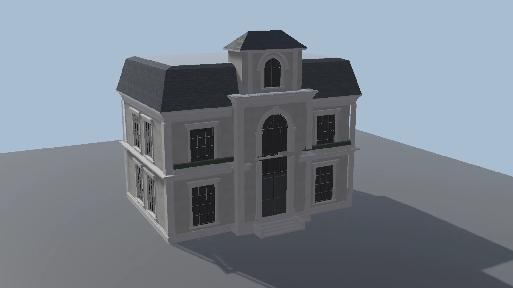

# Buildings

The Buildings module generates modular buildings from a **footprint**, the outline of the building on the ground, and a set of **rules** that decide which walls, floors and roof go where. Change the footprint and the building regenerates.

Open it from the **Buildings** tab of the [World Toolkit window](../getting-started/world-toolkit-window.md).

<figure markdown="span">
  { loading=lazy }
  <figcaption>A building generated from a footprint, a few walls and two roofs.</figcaption>
</figure>

## How a building is put together

**Building**
:   The object in the scene. It has a footprint (a closed spline) and generates the building pieces.

**Volumes**
:   A building is made of one or more volumes: stacked or side-by-side blocks, each with its own footprint, floors, walls and roof. A simple house is one volume. A tower on a podium is two.

**Walls** (Volume Wall asset)
:   What goes along each side of a volume: a stack of **rows** made of prefab pieces (windows, doors, wall panels) or procedural shapes (cornices, bands).

**Roof** (Roof asset)
:   The shape on top of a volume.

**Building Rules** (asset)
:   A reusable recipe of volumes, walls, roofs and floor counts. Apply the same rules to many buildings to give them a shared style.

**Building Block**
:   A large area that splits itself into lots and fills them with buildings.

## The Buildings panel

**Edit Buildings**
:   Edits building footprints in the Scene view. Hold ++shift++ and click to create a new building.

**New Building Defaults**
:   The **Building Rules** for new buildings. **Apply to Selected** gives these rules to the selected buildings. **Draw Creates** chooses whether drawing a closed spline creates a single **Building** or a **Block** that splits into lots.

**Selected Building**
:   **Regenerate** builds the selected buildings again.

## In this section

- [Buildings and Volumes](buildings-and-volumes.md)
- [Building Rules](building-rules.md)
- [Roofs](roofs.md)
- [Building Blocks](building-blocks.md)
- [Style Wizard](style-wizard.md)
