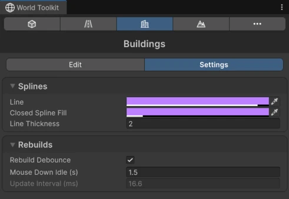

# Buildings Settings

The **Settings** tab of the Buildings panel.

## Splines

<figure markdown="span" class="wtk-ui">
  { loading=lazy }
  <figcaption>The Settings tab of the Buildings panel.</figcaption>
</figure>

**Line**, **Closed Spline Fill** and **Line Thickness** of building footprints in the Scene view.

## Rebuilds

How often buildings regenerate while you drag a footprint. See [Rebuild settings](../getting-started/world-toolkit-window.md#rebuild-settings).

## Generated Piece Pool

Buildings reuse the objects of their pieces instead of creating new ones every time they regenerate, which keeps regeneration fast. **Current Size** shows how many pieces are waiting in the pool, and **Clear Pool** empties it. You'd only need it to free memory after working on very large buildings.
