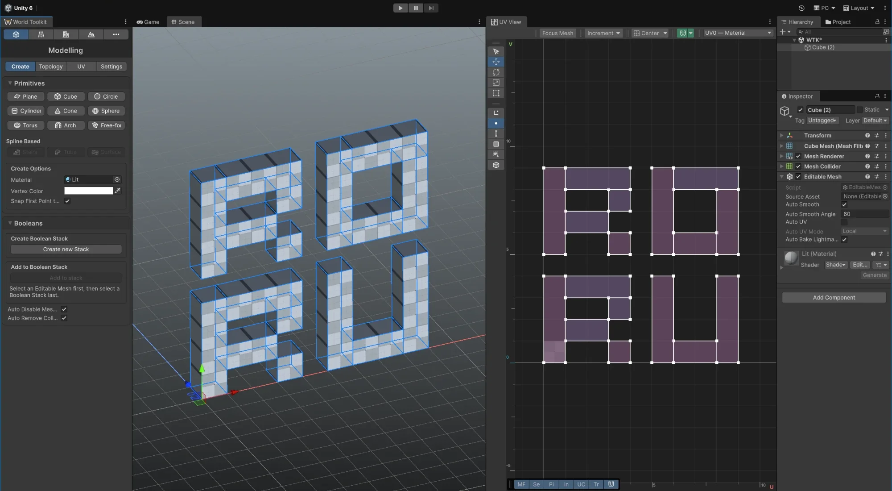

# Getting Started

<figure markdown="span">
  { loading=lazy }
  <figcaption>World Toolkit in the editor: its window on the left, a mesh being edited in the Scene view and its UVs in the UV View.</figcaption>
</figure>

New to World Toolkit? Start here, in this order:

-   :lucide-download:{ .lg .middle } **[1. Installation](installation.md)**

    ---

    Add World Toolkit to your Unity project.

-   :wtk-world:{ .lg .middle } **[2. The World Toolkit Window](world-toolkit-window.md)**

    ---

    The window where every module lives, and the settings they share.

-   :lucide-zap:{ .lg .middle } **[3. Quick Start](quick-start.md)**

    ---

    A short tour from an empty scene to a terrain, a road, a building and a modelled detail.

## :lucide-sparkles: A few ideas that apply everywhere

-   :wtk-splines:{ .lg .middle } **Everything starts from a spline**

    ---

    Roads, building footprints, terrain stamps, spawners and decals are all shaped by [splines](../splines/index.md), and they're all edited with the same controls. Learn them once and every module feels familiar.

-   :lucide-refresh-cw:{ .lg .middle } **Most things are non-destructive**

    ---

    Roads, junctions, buildings, terrain stamps and boolean operations rebuild from their settings whenever something changes. Move a knot and the result follows, so there's no need to get it right the first time.

-   :lucide-file-box:{ .lg .middle } **Rules and presets make setups reusable**

    ---

    Keep a setup in an asset and apply it to new or existing objects: **[Road Rules](../roads/creating-roads.md#road-rules)** for roads and junctions, **[Building Rules](../buildings/building-rules.md)** for buildings, a **[Terrain Stamp Preset](../terrain/stamps.md#presets)** for stamps and **[Spline Array Rules](../more/array-spawner.md#spline-array-rules)** for array spawners.

-   :wtk-context-tips:{ .lg .middle } **Watch the context tips**

    ---

    The panel in the Scene view tells you what clicking, dragging and each key will do with the active tool. See [Context tips](world-toolkit-window.md#context-tips).

