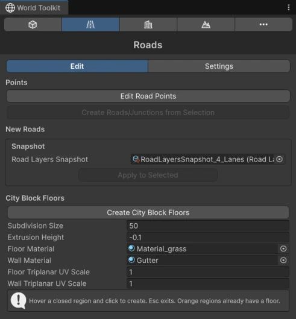

# The World Toolkit Window

Most of World Toolkit is driven from one window. Open it from **Tools > World Toolkit > World Toolkit**.

## Modules

<figure markdown="span" class="wtk-ui">
  { loading=lazy }
  <figcaption>The World Toolkit window: the module bar on top, here showing the Roads module.</figcaption>
</figure>

The bar at the top of the window switches between modules:

| Module | What it's for |
|---|---|
| :wtk-modelling: [Modelling](../modelling/index.md) | Create primitives and edit meshes in the Scene view. |
| :wtk-roads: [Roads](../roads/index.md) | Draw roads and junctions. |
| :wtk-buildings: [Buildings](../buildings/index.md) | Generate and edit modular buildings. |
| :wtk-terrain: [Terrain](../terrain/index.md) | Shape terrains with stamps. |
| :wtk-more: [More](../more/index.md) | Spawners and other extra tools. |

**Only one module is active at a time.** The active module decides what you can click and edit in the Scene view, so switching to **Roads** lets you work on road splines, switching to **Terrain** lets you work on stamps, and so on. Closing the window turns all module tools off.

The window remembers the last module you used while the editor stays open.

## Context tips

:wtk-context-tips: While a module is active, a small panel in the Scene view shows tips for what you're doing right now: which tool is active, what clicking and dragging will do, and which keys are available. You can turn the tips off in the Modelling **Settings** tab, under **Scene View Overlays > Show Context Tips**.

## Rebuild settings

Roads, buildings, terrain stamps and spawners rebuild as you edit them. Each module's **Settings** tab has a **Rebuilds** section that controls how often that happens while you drag:

**Rebuild Debounce**
:   While the mouse is held down, waits until you stop moving before rebuilding. Releasing the mouse always applies the pending rebuild.

**Mouse Down Idle (s)**
:   How long you have to hold still, while dragging, before a rebuild happens. 1.5 seconds by default.

**Update Interval (ms)**
:   With debounce off, the minimum time between rebuilds (16.6 ms by default, about once per frame). Zero rebuilds on every editor update.

Turn debounce off for live feedback on small scenes, and keep it on for heavy roads, buildings or large terrains.

## Settings

Your World Toolkit preferences can be moved between machines or shared with your team:

- **Tools > World Toolkit > Settings > Export Settings…** saves them to a file.
- **Tools > World Toolkit > Settings > Import Settings…** loads them from a file.
- **Tools > World Toolkit > Settings > Restore Default Settings** resets everything.
