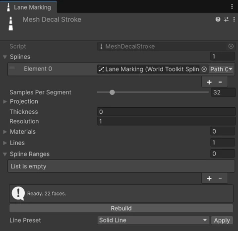

# Decals

Mesh decals are paint-like meshes that follow the surface below them: road markings, crosswalks, painted areas. They're shaped by [splines](../splines/index.md) and generate a thin mesh that fits the ground.

There are two kinds:

:wtk-component-mesh-decal-stroke: **Mesh Decal Stroke**
:   Lines painted **along** a spline, like lane markings.

:wtk-component-mesh-decal-area: **Mesh Decal Area**
:   A filled area **inside** a closed spline, with optional outline lines.

Create them from **GameObject > World Toolkit > Decals**.

## Splines

Both decals take a list of **Splines** to follow or fill. A decal can use splines from different spline containers.

**Samples Per Segment** sets how closely the decal follows the spline between two knots. Raise it for tight curves.

For strokes, **Spline Ranges** limit which parts of each spline get painted. Leave the list empty to paint the whole spline. Enable **Flip** on a range to exclude that part instead.

## Stroke lines

<figure markdown="span" class="wtk-ui">
  { loading=lazy }
  <figcaption>The Mesh Decal Stroke inspector.</figcaption>
</figure>

A stroke is made of one or more lines. Each line has:

| Setting | What it does |
|---|---|
| **Lateral Offset** | Sideways distance from the spline, in meters. Positive is to the right of the spline direction. |
| **Width** | Line width, in meters. |
| **Width Segments** | Quads across the line. Raise it for wide lines on uneven ground. |
| **Trim Start** / **Trim End** | Meters left unpainted at the start and end of the spline. |
| **Dash** | The dash pattern. Its offset shifts the dashes along the line, and it can scale the pattern so the line starts and ends on a full dash. |
| **Material Index** and **Color** | Which of the decal's **Materials** to use, and a tint. |
| **UV Tiles Per Meter** | How many times the texture repeats per meter along the line. |

**Line Preset** sets up common markings in one click: **Solid Line**, **Dashed Lane Line**, **Double Solid**, **Solid + Dashed** and **Dotted**.

## Areas

An area needs a **closed** spline.

**Fill**
:   Choose the pattern **Kind**: **Solid**, **Stripes**, **Grid** or **Checker**. Patterns have an **Angle**, an **Offset**, a **Band Width** and **Band Gap** (plus **Cross Band Width** and **Cross Band Gap** for grids). Turn the fill off to keep only the outline.

**Outline**
:   Lines painted along the border, with the same settings as stroke lines. Positive offsets move them outside the area.

**Outline Lift**
:   Raises the outline slightly above the fill, so the two don't flicker where they overlap.

## Fitting to the surface

The decal finds the ground by casting rays down from the spline.

| Setting | What it does |
|---|---|
| **Surface Layers** | The collider layers the decal lands on. |
| **Projection Height** / **Projection Depth** | How far above and below the spline it looks for a surface. |
| **Surface Offset** | A small lift above the surface, to avoid flickering (z-fighting). |
| **Offset Along Normal** | Lifts along the surface direction instead of straight up. |
| **Hit Backfaces** | Also lands on the back side of faces. |
| **Miss Behaviour** | What to do where no surface is found: keep the spline height, or remove those faces. |
| **Thickness** | Gives the decal depth, extruding it from the surface and closing its sides. Zero keeps it flat. |
| **Resolution** | The size of the triangles that follow the relief. Smaller values follow bumps more closely. |

!!! note
    Decals rebuild when you edit their splines, but they don't notice changes to the terrain or colliders below them. After editing the ground, click **Rebuild** in the decal's inspector.

The inspector shows the build status: **Ready** with the face count, or a message when something is wrong, such as no spline assigned, an area spline that isn't closed, or no surface found below.
