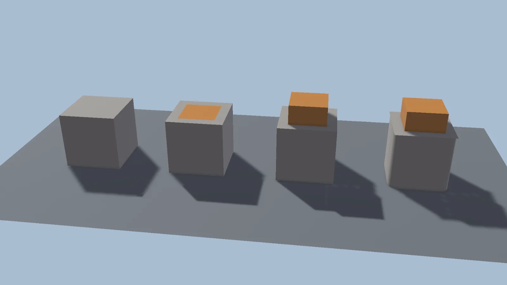
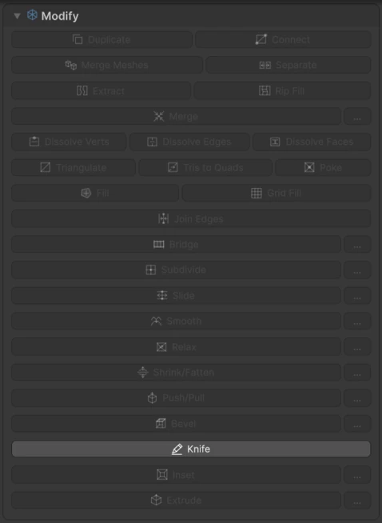
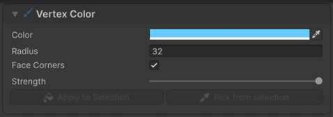
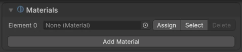

# Editing Tools

All editing tools live in the **Topology** tab of the Modelling panel. They act on the current [selection](selection.md).

!!! tip "Quick tool search"
    **Right-click** in the Scene view (without dragging) while editing a mesh to open **Modelling Tools**, a searchable list of every tool. It shows your **Recent** and **Pinned** tools at the top.

## Tools with options

<figure markdown="span">
  { loading=lazy }
  <figcaption>From left: a cube, then Inset on the top face, Extrude of the inset face, and Bevel on the vertical edges.</figcaption>
</figure>

These tools show an options panel in the Scene view. Adjust the options, check the preview, then press **Apply**, or **Cancel** to leave without changing anything. The **...** button next to each tool in the panel shows or hides its Scene view options.

### :wtk-modify-extrude: Extrude

Pulls the selected faces or edges out to create new geometry.

**Distance**
:   How far to extrude.

**Keep faces together**
:   Extrudes connected faces as one region. Turn it off to extrude each face separately.

**Follow normals average**
:   Moves the extruded geometry along the average direction of the faces.

**Shell**
:   Keeps the original faces, flipped, as an inner cap. Useful to give thickness to an open surface.

**Auto Trim Collisions**
:   When the extrusion goes through another part of the same mesh, cuts an opening there. Useful for making passages through walls.

**Hard Edge Angle**
:   Edges created by the extrusion are marked hard (sharp shading) when the angle between their faces reaches this value. Flatter edges stay smooth.

### :wtk-modify-inset: Inset

Creates a smaller copy of the selected faces inside them, for panels, windows and borders.

**Inset Mode**
:   **Region** insets the selection as one area. **Individual** insets each face on its own.

**Distance**
:   How far inward the new edges are.

### :wtk-modify-bevel: Bevel

Rounds or cuts the selected edges or vertices.

**Distance**
:   The width of the bevel.

**Segments**
:   How many faces make up the bevel. Use 1 for a flat cut, more for a rounded edge.

**Profile** and **Profile Shape**
:   The curvature of the bevel.

**Junctions**
:   How corners where several beveled edges meet are filled: with segmented faces (**Segmented**) or with a single polygon (**Ngon**).

### :wtk-modify-bridge: Bridge

Connects two selected face groups, edge chains or edge loops with new faces. Handy for joining two parts of a mesh or closing a gap between them.

### :wtk-modify-merge: Merge

Merges the selected vertices.

**Variant**
:   - **Center**: all selected vertices become one, at their center.
    - **Cursor**: all selected vertices become one, at the custom pivot position (see [Transform](transform.md#custom-pivots)).
    - **Collapse**: each connected group of selected vertices becomes its own vertex.
    - **Distance**: only selected vertices closer than **Distance** are merged.

### :wtk-modify-knife: Knife

Cuts new edges across faces by hand.

- **Click** on surfaces or edges to place cut points.
- Hold ++shift++ over an edge for a **loop cut** all around the mesh, then click to apply.
- Press ++enter++ or **right-click** to apply the cut.
- ++backspace++ removes the last point, ++esc++ cancels.

**Selected Only**
:   Only cuts the selected edges or faces.

**Step**
:   Snaps cut points along edges in steps. 0 is continuous; 0.25 snaps to quarters of the edge.

### :wtk-modify-slide: Slide

Slides the selected vertices or edges along the surrounding edges, without changing the shape of the surface. **Step** snaps the slide amount.

### :wtk-modify-subdivide: Subdivide

Splits the selected faces or edges. **Cuts** sets how many times.

## Deformation

These tools use a **Distance** value as strength:

:wtk-modify-smooth: **Smooth**
:   Smooths the selected vertices. Strength from 0 to 1.

:wtk-modify-relax: **Relax**
:   Evens out the spacing of the selected vertices along the surface, without flattening it. Strength from 0 to 1.

:wtk-modify-shrink-fatten: **Shrink/Fatten**
:   Moves the selected vertices along their normals. Positive values inflate, negative values deflate.

:wtk-modify-push-pull: **Push/Pull**
:   Moves the selected vertices away from or toward the transform pivot.

## Modify

<figure markdown="span" class="wtk-ui">
  { loading=lazy }
  <figcaption>The Modify section. The **...** buttons show each tool's options in the Scene view.</figcaption>
</figure>

| Tool | What it does |
|---|---|
| :wtk-modify-duplicate: **Duplicate** | Duplicates the selected components inside the same mesh. |
| :wtk-modify-connect: **Connect** | Connects the selected vertices, or pairs of edges, with a new edge across the face. |
| :wtk-modify-merge-meshes: **Merge Meshes** | Merges the selected objects into the active one. |
| :wtk-modify-separate: **Separate** | Moves the selected faces into a new object. |
| :wtk-modify-rip: **Rip** | Tears the selection open, so it can be pulled apart. In face mode the button reads **Extract**: the faces are detached as their own island. |
| :wtk-modify-rip-fill: **Rip Fill** | Tears the selection open and fills simple gaps. |
| :wtk-modify-dissolve-vertices: **Dissolve Verts** | Removes the selected vertices but keeps the surrounding faces. |
| :wtk-modify-dissolve-edges: **Dissolve Edges** | Removes the selected edges but keeps the surrounding faces. |
| :wtk-modify-dissolve-faces: **Dissolve Faces** | Merges the selected connected faces into one. |
| :wtk-modify-triangulate: **Triangulate** | Splits the selected faces into triangles. |
| :wtk-modify-tris-to-quads: **Tris to Quads** | Joins pairs of adjacent triangles into quads. |
| :wtk-modify-poke: **Poke** | Splits each selected face into triangles around a new center vertex. |
| :wtk-modify-fill: **Fill** | Creates a face from the selected vertices or edge loop. |
| :wtk-modify-grid-fill: **Grid Fill** | Fills a closed edge loop with a grid of quads. |
| :wtk-modify-join-edges: **Join Edges** | Welds two open edge chains with the same number of edges. |

## Boolean (destructive)

**Surface Cut**
:   Cuts the active mesh with the other selected meshes. The cutting meshes are kept. Select the mesh to be cut **last**.

For non-destructive booleans, see [Booleans](booleans.md).

## :wtk-normals: Normals and shading

**Modify Normals**
:   **Flip Normals** reverses the selected faces. **Recalc Outside** and **Recalc Inside** make the selected faces point away from or toward their center.

**Modify Shading**
:   **Flat Faces** and **Smooth Faces** set flat or smooth shading. **Smooth by Angle** smooths everything except edges sharper than **Smooth by Angle Limit**. **Mark Hard** and **Clear Hard** set sharp shading on individual edges. **Set Custom Normals** and **Clear Custom Normals** store or remove the current face normals.

## :wtk-mesh-cleanup: Cleanup

| Tool | What it does |
|---|---|
| **Weld** | Welds selected vertices closer than **Weld Distance**. |
| **Weld Doubles** | Welds overlapping vertices closer than **Weld Distance**. |
| **Delete Loose** | Deletes selected vertices and edges that don't belong to any face. |
| **Remove Degenerate** | Removes broken, zero-area faces and edges. |
| **Dissolve** / **Limited Dissolve** | Removes interior edges between faces that are nearly flat, under **Limited Angle**. |
| **Create Support Edge** | Adds an edge between exactly two selected vertices. |
| **Validate Mesh** | Writes a report of topology problems to the Console. |
| **Delete Unused Materials** | Removes material slots no face uses. |

## :wtk-brush: Vertex colors

<figure markdown="span" class="wtk-ui">
  { loading=lazy }
  <figcaption>The Vertex Color section.</figcaption>
</figure>

Click **Paint** in the Modelling Edit toolbar to paint vertex colors by dragging over the mesh. Click it again to stop.

**Color**
:   The paint color. White visually erases painted color.

**Radius** and **Strength**
:   The brush size (in screen pixels) and how much each stroke blends in.

**Face Corners**
:   Paints only the corners of the face under the cursor. Turn it off to paint every face inside the brush.

**Apply to Selection** fills the selection with the current color, and **Pick from selection** takes the color from the selection.

## :wtk-materials: Materials

<figure markdown="span" class="wtk-ui">
  { loading=lazy }
  <figcaption>The Materials section.</figcaption>
</figure>

The **Materials** section lists the mesh's material slots.

- **Add Material** adds a slot.
- **Assign** gives the slot's material to the selected faces.
- **Select** adds the faces that use that slot to the selection.
- **Delete** removes the slot.
