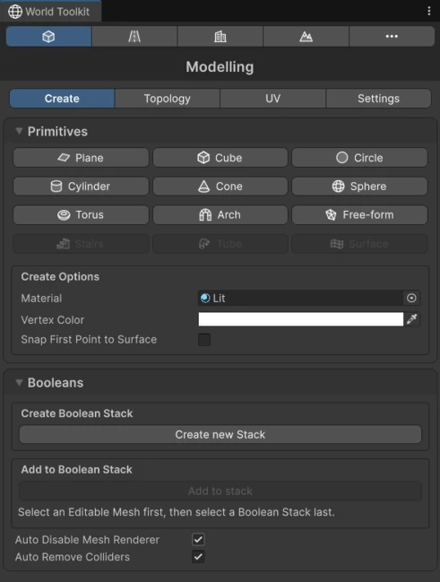
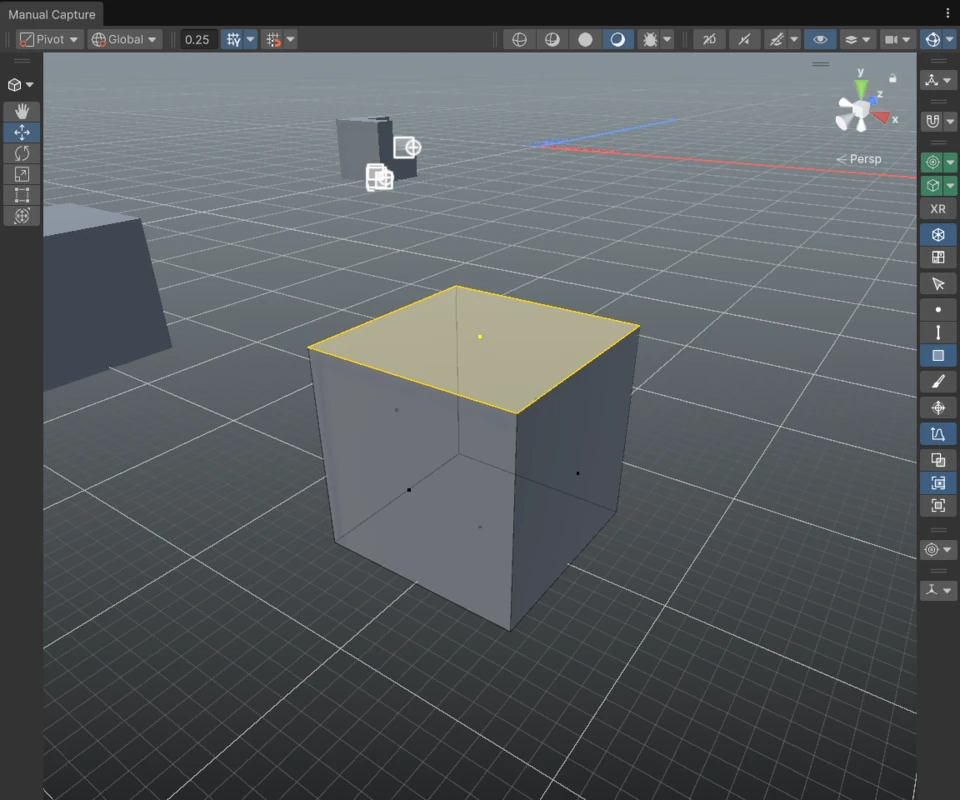

# Modelling

The Modelling module lets you build and edit meshes directly in the Scene view, without leaving Unity. It's meant for blockouts, level geometry, props and any mesh you'd like to tweak in place.

Open it from the **Modelling** tab of the [World Toolkit window](../getting-started/world-toolkit-window.md).

## The Modelling tabs

<figure markdown="span" class="wtk-ui">
  { loading=lazy }
  <figcaption>The Create tab of the Modelling panel.</figcaption>
</figure>

The Modelling panel has four tabs:

**Create**
:   Create [primitives](primitives.md) (cubes, cylinders, stairs and more) and [Boolean Stacks](booleans.md).

**Topology**
:   Edit the selected mesh: [select](selection.md) vertices, edges and faces, [transform](transform.md) them and use the [editing tools](editing-tools.md). It also holds vertex color painting, materials, normals and cleanup tools.

**UV**
:   Edit [texture coordinates](uvs.md).

**Settings**
:   Colors, sizes and visibility of everything Modelling draws in the Scene view, plus a few behavior options.

The panel follows what you're doing: picking a primitive switches to **Create**, and starting to edit a mesh switches to **Topology**.

## Editing in the Scene view

<figure markdown="span" class="wtk-ui-wide">
  { loading=lazy }
  <figcaption>Editing faces: the Modelling Edit toolbar on the right, the selected face highlighted, and the context tips at the bottom.</figcaption>
</figure>

When you edit a mesh's vertices, edges or faces, Unity switches its **Tool Context** to **WTK: Editable Mesh**. A **Modelling Edit** toolbar appears in the Scene view with the component modes (vertices, edges, faces), the selection tool, vertex painting and X-Ray.

Many tools also show an options panel in the Scene view (for example **Extrude Options**), where you tweak the operation and then press **Apply** or **Cancel**.

## In this section

- [Editable Meshes](editable-meshes.md): the component behind every mesh you edit.
- [Primitives](primitives.md): creating new shapes.
- [Selection](selection.md): picking vertices, edges and faces.
- [Transform](transform.md): moving, rotating and scaling, snapping.
- [Editing Tools](editing-tools.md): extrude, bevel, inset, knife and the rest.
- [UVs](uvs.md): texture coordinates.
- [Booleans](booleans.md): combining and cutting meshes.
- [Decals](decals.md): painted lines and areas that follow surfaces.
