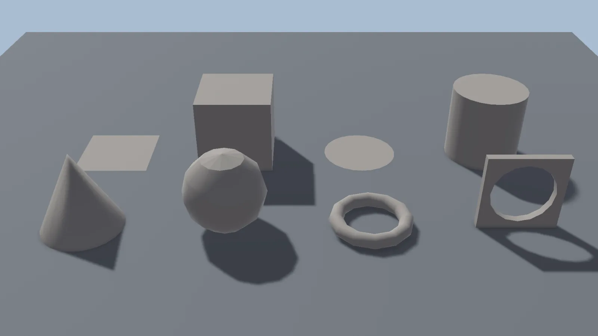

# Primitives

Primitives are the starting point for most models. Pick one in the **Create** tab of the Modelling panel, then draw it in the Scene view.

<figure markdown="span">
  { loading=lazy }
  <figcaption>Back row: Plane, Cube, Circle and Cylinder. Front row: Cone, Sphere, Torus and Arch.</figcaption>
</figure>

## Available primitives

| | | |
|---|---|---|
| **Plane** | **Cube** | **Circle** |
| **Cylinder** | **Cone** | **Sphere** |
| **Torus** | **Arch** | **Free-form** |

The last row creates meshes from a spline. Select an object with a spline first:

**Stairs**
:   Creates editable stairs along the selected spline.

**Tube**
:   Creates an editable tube along the selected spline.

**Surface**
:   Creates a surface that fills the area enclosed by the selected spline.

## Drawing a primitive

1. Click a primitive in the **Create** tab.
2. **Drag** in the Scene view to draw its footprint. Hold ++ctrl++ while dragging to keep the footprint proportional.
3. For shapes with height (cube, cylinder, cone and so on), release the mouse, **move it** to set the height, and **click** to finish.

The **Create Mesh Options** panel appears in the Scene view while you draw. It shows the dimensions (**Width**, **Depth**, **Height**, **Radius**...) and the detail settings (**Subdivisions**, **Sides**, **Segments**). You can type exact values there.

**Create** in that panel builds the primitive again at the last footprint you drew. If you haven't drawn one yet, it uses the typed dimensions at the world origin. **Cancel** stops the creation.

### Free-form

**Free-form** draws a flat polygon point by point:

- **Click** to add each point.
- Press ++enter++ or **right-click** to finish the shape.

## Creation options

**Orient**
:   The plane the footprint is drawn on: the surface you start on (**Placement Plane**), or always flat (**World Up**).

**Orient to First Step**
:   The first drag sets the direction of one side, and a second step sets the depth. Useful for drawing boxes that are rotated to match something already in the scene.

**Snap First Point to Surface**
:   Places the first point on the surface under the cursor, even if snapping is off. The following steps stay on the plane started by that first point.

**Material** and **Vertex Color** (under **Create Options**)
:   The material and vertex color given to new meshes.

## After creating

A new primitive keeps its parameters, so you can still change its size or number of segments in the **Topology** tab. To edit its vertices, edges and faces, use **Make Editable** first. See [Editable Meshes](editable-meshes.md#editable-primitives).
