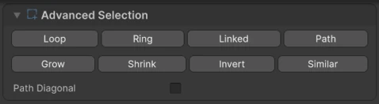
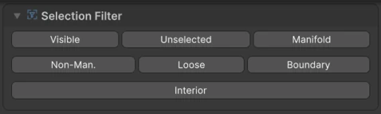
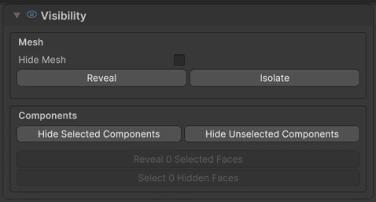

# Selection

To edit a mesh you select its **components**: vertices, edges or faces.

## Component modes

Pick the component type in the **Modelling Edit** toolbar in the Scene view, or with the keyboard:

| Key | Mode |
|---|---|
| ++1++ | :wtk-select-vertex: Vertices |
| ++2++ | :wtk-select-edge: Edges |
| ++3++ | :wtk-select-face: Faces |

Choosing a component mode switches Unity's tool context to **WTK: Editable Mesh**, where clicks select components instead of objects.

## Selecting

- **Click** a component to select it.
- **Drag** across empty space to box-select.
- ++q++ switches to the :wtk-select: **Select** tool.

### Box selection rules

The toolbar lets you decide what a box selection includes:

**Edges**
:   :wtk-box-intersect: **Intersecting** (any edge the box touches), :wtk-box-center: **Midpoint** (edges whose middle is inside the box) or :wtk-box-inside: **Fully Inside**.

**Faces**
:   :wtk-box-intersect: **Touching Box**, :wtk-box-center: **Center Only** (faces whose center is inside the box) or :wtk-box-inside: **Fully Inside**.

## Keyboard shortcuts

| Shortcut | Action |
|---|---|
| ++ctrl+a++ | Select all |
| ++ctrl+i++ | Invert the selection |
| ++shift+period++ | Grow the selection |
| ++shift+comma++ | Shrink the selection |
| ++ctrl+d++ | Duplicate the selected components |
| ++delete++ or ++backspace++ | Delete the selected components |

On macOS, use ++cmd++ instead of ++ctrl++.

## :wtk-selection-add: Advanced Selection

<figure markdown="span" class="wtk-ui">
  { loading=lazy }
  <figcaption>Advanced Selection in the Topology tab.</figcaption>
</figure>

Found in the **Topology** tab:

**Loop**
:   Selects the loop that runs through the current selection.

**Ring**
:   Selects the ring of edges or faces around the current selection.

**Linked**
:   Selects everything connected to the current selection.

**Path**
:   Selects the shortest path between the first and the last selected components. Enable **Path Diagonal** to let the path cross faces diagonally, for straighter paths.

**Grow / Shrink**
:   Expands or reduces the selection by one step.

**Invert**
:   Selects everything that isn't selected, and deselects the rest.

**Similar**
:   Selects components similar to the current selection.

**Convert Selection** turns the current selection into another component type, for example from faces to their edges.

## :wtk-selection-filter: Selection Filter

<figure markdown="span" class="wtk-ui">
  { loading=lazy }
  <figcaption>The Selection Filter.</figcaption>
</figure>

Selects components by their properties:

| Filter | Selects |
|---|---|
| **Visible** | Components that aren't hidden. |
| **Unselected** | Everything currently not selected. |
| **Manifold** | Components that are part of a closed, clean surface. |
| **Non-Man.** | Non-manifold components, often the source of shading or export problems. |
| **Loose** | Vertices and edges that don't belong to any face. |
| **Boundary** | Components on an open border of the mesh. |
| **Interior** | Components that aren't on a border. |

## :wtk-visibility: Hiding components and objects

<figure markdown="span" class="wtk-ui">
  { loading=lazy }
  <figcaption>The Visibility section.</figcaption>
</figure>

Hide parts of a mesh to reach what's behind them. Under **Visibility** in the **Topology** tab:

- **Hide Selected Components** and **Hide Unselected Components**.
- **Reveal** brings hidden components of the current type back, and **Select Hidden** selects them.

For whole objects:

- **Hide Mesh** hides or shows the selected objects, the same as the eye icon in the Hierarchy.
- **Isolate** shows only the selected objects.
- **Reveal** shows the other hidden objects again.

## X-Ray

The **XR** button in the Modelling Edit toolbar turns on a temporary X-Ray view of the selected meshes. You can see and select components on the far side.
