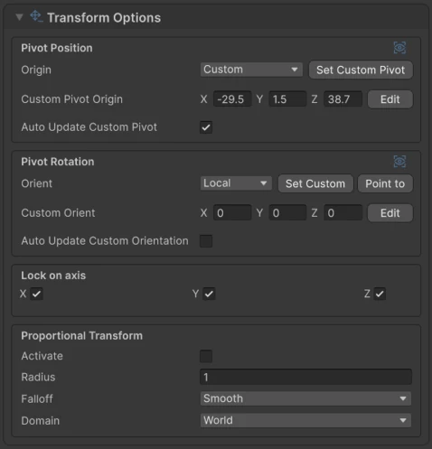
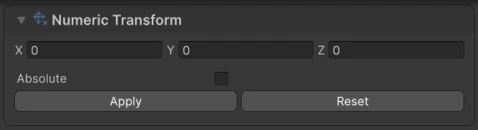

# Transform

Move, rotate and scale the selected components with Unity's regular **Move**, **Rotate** and **Scale** tools. The handle appears at the selection's pivot.

## Pivot and orientation

**Origin** sets where the handle sits:

| Origin | Pivot |
|---|---|
| :wtk-pivot-origin-center: **Center** | The center of the whole selection. |
| :wtk-pivot-origin-individual: **Individual** | Each selected element transforms around its own center. |
| :wtk-pivot-origin-custom: **Custom** | A position you stored with **Set Custom Pivot**. |

**Orient** sets how the handle is rotated:

| Orient | Axes |
|---|---|
| :wtk-pivot-orientation-global: **Global** | World axes. |
| :wtk-pivot-orientation-local: **Local** | The object's axes. |
| :wtk-pivot-orientation-normal: **Normal** | Aligned to the selection's surface direction. |
| :wtk-pivot-orientation-edges: **Edges** | Aligned to the selected edges. |
| :wtk-pivot-orientation-custom: **Custom** | A rotation you stored with **Set Custom**, or set with **Point to**, which aims from the custom pivot toward the selection. |

Press ++z++ to cycle through the origins and ++x++ to cycle through the orientations. Both shortcuts can be changed in Unity's **Shortcuts** window, under **Modelling**.

### Custom pivots

With **Origin** set to **Custom**:

- **Set Custom Pivot** stores the center of the current selection.
- **Edit** moves the stored pivot with a handle in the Scene view.
- **Auto Update Custom Pivot** moves the stored pivot along with the selection when you use **Move**.

**Custom Orient** works the same way, with **Auto Update Custom Orientation** following **Rotate**.

## :wtk-transform-options: Transform Options

<figure markdown="span" class="wtk-ui">
  { loading=lazy }
  <figcaption>Transform Options: pivot position and rotation, axis locks and proportional editing.</figcaption>
</figure>

**Lock on axis**
:   Restricts the transform to the chosen axes.

:wtk-proportional-transform: **Proportional Transform**
:   Also moves nearby unselected components, fading with distance, for smooth soft edits. Set the **Radius** of the effect and its **Falloff** shape: **Smooth**, **Sphere**, **Root**, **Sharp**, **Linear**, **Constant**, or a **Custom** curve. **Domain** decides what counts as "nearby": everything within the radius (**World**), or only components connected to the selection (**Connected**).

:wtk-proportional-2-axis: **Proportional 2-Axis Scaling**
:   A toolbar toggle. When you drag one of the **Scale** tool's plane handles, which scale two axes at once, both axes scale by the same amount.

## :wtk-transform-numeric: Numeric Transform

<figure markdown="span" class="wtk-ui">
  { loading=lazy }
  <figcaption>Numeric Transform.</figcaption>
</figure>

Type exact values instead of dragging:

1. Choose **Move**, **Rotate** or **Scale**.
2. Enter the values and press **Apply**. **Reset** clears them.

**Absolute**
:   Moves the pivot to the typed world position, instead of moving by that amount.

**Flip Normals**
:   When a scale mirrors the faces (one or three negative axes), flips them so they keep facing outward.

**Flip UVs**
:   When a scale is negative, mirrors the UVs too. Faces with automatic UVs become manual.

## :wtk-snap: Snapping

Press ++shift+v++ to turn snapping on or off. The **Snapping** panel in the Scene view sets what the selection snaps to and how close it has to be.
