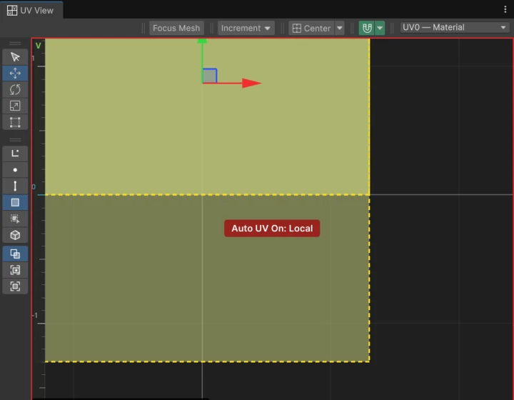
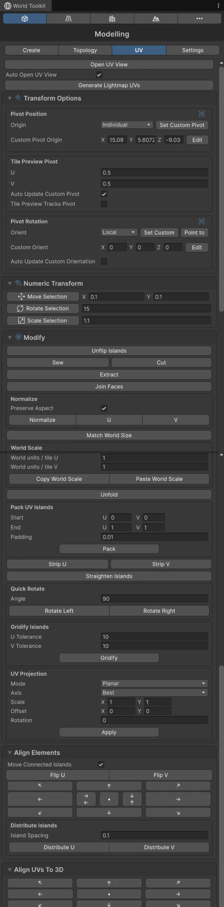

# UVs

UVs decide how textures wrap around a mesh. You can let World Toolkit generate them, or edit them by hand in the **UV** tab and the **UV View**.

## Automatic UVs

By default, Editable Meshes can generate their UVs from the geometry with **Auto UV**, in local or world space. See [Editable Meshes](editable-meshes.md#uv-options).

Editing UVs by hand switches the edited faces to manual UVs. Turning **Auto UV** back on replaces the current UVs with generated ones, and you'll be asked to confirm because manual edits are lost.

## :wtk-uv-view: The UV View

<figure markdown="span" class="wtk-ui-wide">
  { loading=lazy }
  <figcaption>The UV View, with the tools on the left and the snapping, pivot and UV channel options on top.</figcaption>
</figure>

**Open UV View** in the **UV** tab opens the UV editor, which shows the selected mesh's UVs over its texture. Turn on **Auto Open UV View** to open it every time you switch to the **UV** tab.

### Selecting UVs

UV selection works on its own component types, chosen in the toolbar or with the keyboard inside the UV View:

| Key | Mode |
|---|---|
| ++1++ | Vertices |
| ++2++ | Edges |
| ++3++ | Faces |
| ++4++ | Islands |

The toolbar also has **UV corners** and **Connected 3D** modes, and box-selection rules for edges and faces, as in the [Scene view](selection.md#box-selection-rules).

## Transforming UVs

<figure markdown="span" class="wtk-ui">
  { loading=lazy }
  <figcaption>The UV tab of the Modelling panel.</figcaption>
</figure>

Move, rotate and scale UVs with the regular transform tools, or with exact values under **Numeric Transform**: **Move Selection**, **Rotate Selection** and **Scale Selection** apply the typed offset, angle or factor.

## Seams and islands

**Cut**
:   Cuts the selected UV edges, creating a seam.

**Sew**
:   Sews the selected UV edges back together.

**Extract**
:   Turns the selection into separate UV islands.

**Join Faces**
:   Moves the selected islands to their matching shared edges and sews them.

**Unflip Islands**
:   Fixes islands that ended up mirrored.

UV seams are drawn as dashed lines in the Scene view while the **UV** tab is active.

## Layout tools

**Normalize**
:   Fits the selection into the 0–1 texture square. With **Preserve Aspect** off, it stretches to fill the whole square.

**Match World Size**
:   Scales islands so that their texture density matches their real size in the scene.

**Unfold**
:   Flattens the selected UVs while keeping seams and leaving unselected UVs where they are.

**Pack**
:   Arranges whole islands inside the texture area without changing their proportions.

**Strip U** / **Strip V**
:   Lays the selected faces out as one horizontal or vertical strip. Useful for trims, pipes and road-like textures.

**Straighten Islands**
:   Rotates each island so it lines up with the U or V axis.

**Gridify**
:   Lines up rows and columns of UVs into a clean grid. **U Tolerance** and **V Tolerance** set how far from horizontal or vertical an edge can be and still count as part of a row or column.

## Projection

**UV Projection** projects UVs onto the selection from a simple shape:

**Mode**
:   **Planar**, **Box**, **Cylindrical** or **Spherical**.

**Axis**
:   The projection direction. **Best** picks the right one for each face.

**Scale**, **Offset** and **Rotation** adjust the result. Press **Apply** to project.

## Lightmap UVs

**Generate Lightmap UVs** creates the second UV set (UV1) used for baked lighting, and doesn't change your texture UVs (UV0). Then enable **Contribute GI** on the object and bake from Unity's **Lighting** window.
