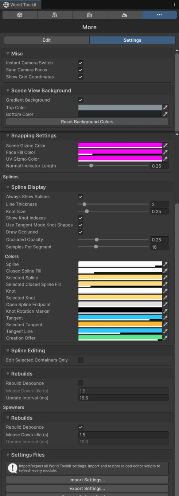

# More Settings

The **Settings** tab of the More module holds settings shared by every module.

## Misc

<figure markdown="span" class="wtk-ui">
  { loading=lazy }
  <figcaption>The Settings tab of the More module.</figcaption>
</figure>

**Instant Camera Switch**
:   Skips the Scene view's animated transition when switching camera views.

**Sync Camera Focus**
:   Keeps the Scene view's focus point when switching camera views, and keeps the zoom between orthographic views.

**Show Grid Coordinates**
:   Writes the world coordinates of one grid cell near the center of each Scene view.

## Scene View Background

**Gradient Background**
:   Replaces the Scene view's flat background with a gradient from **Top Color** to **Bottom Color**. **Reset Background Colors** puts the default colors back.

## Snapping Settings

Colors of the snapping gizmos in the Scene view and in the UV View (**Scene Gizmo Color**, **Face Fill Color**, **UV Gizmo Color**), and **Normal Indicator Length**, the length of the line showing the surface direction while snapping.

## Splines

How splines are drawn and edited everywhere, and how often spline-driven objects rebuild while you drag. See [Spline Settings](../splines/settings.md).

## Spawners

How often [spawners](index.md) rebuild while you drag. See [Rebuild settings](../getting-started/world-toolkit-window.md#rebuild-settings).

## Settings files

**Import Settings…**, **Export Settings…** and **Restore Default Settings** for all World Toolkit preferences. See [The World Toolkit Window](../getting-started/world-toolkit-window.md#settings).
