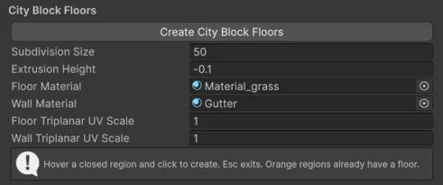
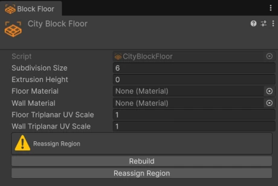

# City Blocks

A :wtk-component-city-block-floor: **City Block Floor** fills a closed area surrounded by roads and junctions, such as the ground of a city block, a park or a plaza. It follows the inner edges of the roads around it, and rebuilds when they change.

## Creating floors

<figure markdown="span" class="wtk-ui">
  { loading=lazy }
  <figcaption>The City Block Floors section of the Roads panel.</figcaption>
</figure>

1. In the **Roads** panel, click **Create City Block Floors**.
2. **Hover** a closed region between roads. It's highlighted.
3. **Click** to create a floor there.

Regions shown in **orange** already have a floor. Press ++esc++ to stop.

## Settings

<figure markdown="span" class="wtk-ui">
  { loading=lazy }
  <figcaption>The City Block Floor inspector.</figcaption>
</figure>

**Extrusion Height**
:   Gives the floor a thickness, with walls down its sides. Useful for raised blocks.

**Floor Material** and **Wall Material**
:   Materials for the top and the sides, with **Floor Triplanar UV Scale** and **Wall Triplanar UV Scale** for texture size.

**Subdivision Size**
:   The size of the triangles on the floor surface.

## When roads change

The floor follows the roads around it. If the region it belonged to changes a lot (for example, a road is removed), the floor may need to be assigned again:

- **Rebuild** builds the floor again from its current region.
- **Reassign Region** lets you click the region it should fill.

The inspector shows the floor's build status.
