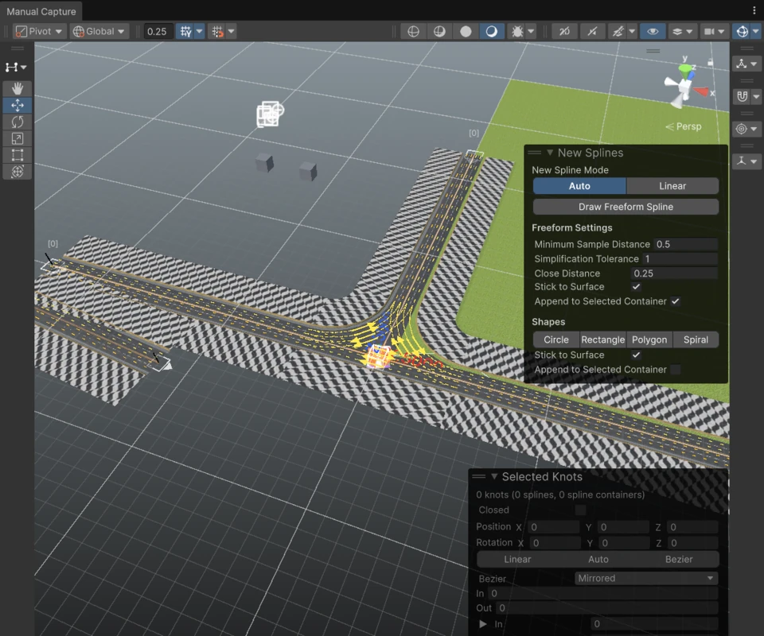
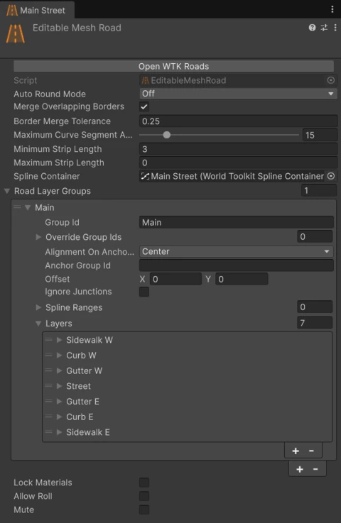

# Creating Roads

## Drawing a road

1. In the **Roads** panel, click **Edit Road Points**.
2. Hold ++shift++ and **click** in the Scene view to start a new road, then **click** to add more points.
3. Press ++esc++ or **right-click** to finish.

New roads use the **Road Layers Snapshot** set under **New Roads** in the Roads panel.

To continue an existing road, start drawing from one of its ends.

### Connecting while drawing

- Click on **another road** to create a [junction](junctions.md) there.
- Click on an **existing junction** to connect the new road to it.

## Editing a road

<figure markdown="span" class="wtk-ui-wide">
  { loading=lazy }
  <figcaption>Editing road points: the road splines with their knots, and the spline panels.</figcaption>
</figure>

With **Edit Road Points** active:

- **Click** spline knots to select them.
- **Drag** selected knots or their handles to reshape the road.
- **Drag a road end** onto another road to create a junction, or onto a junction to connect to it.

Knots work the same as on any [spline](../splines/spline-container.md#editing-knots), including the right-click menu.

Select a road and click **Open WTK Roads** in its inspector to jump to the Roads panel.

## Converting existing splines

Select one or more spline containers and click **Create Roads/Junctions from Selection**. Splines become roads, and [linked knots](../splines/link-groups.md) become junctions.

## Road settings

<figure markdown="span" class="wtk-ui">
  { loading=lazy }
  <figcaption>The road inspector.</figcaption>
</figure>

**Lock Materials**
:   Keeps the current material slots when the road rebuilds, instead of resetting them from the profiles.

**Allow Roll**
:   Lets the road bank (tilt sideways) following each knot's rotation, for banked curves.

**Mute**
:   Temporarily turns the road off.

### Rounded corners

**Auto Round Mode** rounds sharp turns of straight-segment (linear) splines automatically:

| Mode | What it does |
|---|---|
| **Off** | No rounding. |
| **All** | Rounds every turn sharper than **Auto Round Corners Minimum Turn Angle**, with **Auto Round Desired Curve Radius**. |
| **Per Knot** | Only rounds the knots listed in **Auto Round Knots**, each with its own radius. |

The radius you set is a target: short segments or nearby corners can make the actual curve smaller. A radius of zero keeps the corner sharp.

### Mesh detail

**Maximum Curve Segment Angle**
:   How much the road can turn within one mesh segment. Lower values give smoother curves and more triangles.

**Minimum Strip Length** / **Maximum Strip Length**
:   Limits on the length of each mesh segment along the road. Zero turns a limit off.

### Joining borders

**Merge Overlapping Borders**
:   Welds border vertices that touch the borders of this road or of other roads, to close small gaps. Both roads need it enabled.

**Border Merge Tolerance**
:   How close two border vertices must be to merge.

## Road Layers Snapshots

A **Road Layers Snapshot** stores a road's full layer setup, plus its generation settings (roll, rounding, mesh detail) and a fallback junction material.

- **Create one from a road:** right-click the road component and choose **Create Road Layers Snapshot From Current Setup...**.
- **Create an empty one:** **Assets > Create > World Toolkit > Roads > Layers Snapshot**.
- **Use it for new roads:** set it under **New Roads** in the Roads panel.
- **Apply it to existing roads:** select them and click **Apply to Selected**.

!!! warning
    **Apply to Selected** replaces the selected roads' layers, lane directions, extra lanes, ranges, groups and sublayers. You'll be asked to confirm.
