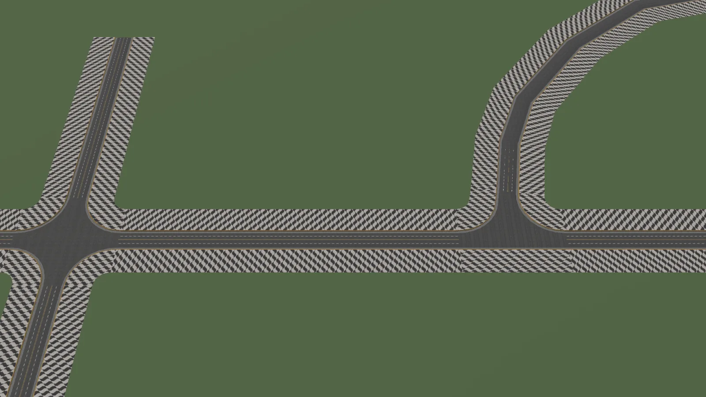

# Roads

The Roads module builds road meshes from splines. You draw where the road goes, and World Toolkit generates the surface, lanes, sidewalks and curbs, plus the junctions where roads meet.

Open it from the **Roads** tab of the [World Toolkit window](../getting-started/world-toolkit-window.md).

<figure markdown="span">
  { loading=lazy }
  <figcaption>Six roads joined by a cross junction and a T junction.</figcaption>
</figure>

## The building blocks

:wtk-component-editable-mesh-road: **Road** (Editable Mesh Road component)
:   One road, following a [spline](../splines/index.md). Its cross-section is made of **layers**: the driving lanes, sidewalks, curbs and so on.

**Road Profile** (asset)
:   The 2D shape of one layer, like the shape of a curb or a sidewalk. See [Profiles and Layers](profiles-and-layers.md).

**Road Layers Snapshot** (asset)
:   A saved layer setup you can reuse for new roads or apply to existing ones.

:wtk-component-editable-mesh-junction: **Junction** (Editable Mesh Junction component)
:   The generated mesh where two or more roads meet. See [Junctions](junctions.md).

:wtk-component-road-anchor-connection: **Road Anchor Connection**
:   A road that attaches to the side of another road without a full junction. See [Anchored Connections](anchored-connections.md).

:wtk-component-city-block-floor: **City Block Floor**
:   Fills the area enclosed by roads, for example a block's ground. See [City Blocks](city-blocks.md).

## The Roads panel

**Points**
:   **Edit Road Points** edits road splines in the Scene view. **Create Roads/Junctions from Selection** converts the selected splines into roads and junctions.

**New Roads**
:   The **Road Layers Snapshot** used for roads you draw. **Apply to Selected** replaces the layer setup of the selected roads with it.

**City Block Floors**
:   Creates floors for the areas between roads.

**Default Junction Settings** and **Conversions**
:   The starting values for new junctions.

The **Settings** tab sets how road splines and lanes are drawn in the Scene view, and when roads rebuild.

## In this section

- [Creating Roads](creating-roads.md)
- [Profiles and Layers](profiles-and-layers.md)
- [Junctions](junctions.md)
- [Anchored Connections](anchored-connections.md)
- [City Blocks](city-blocks.md)
