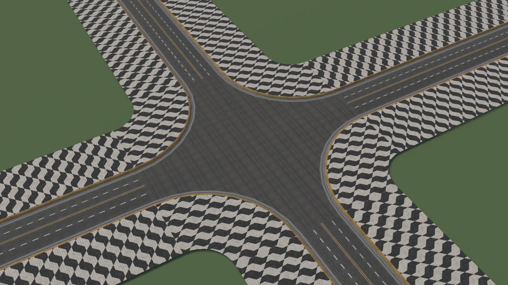
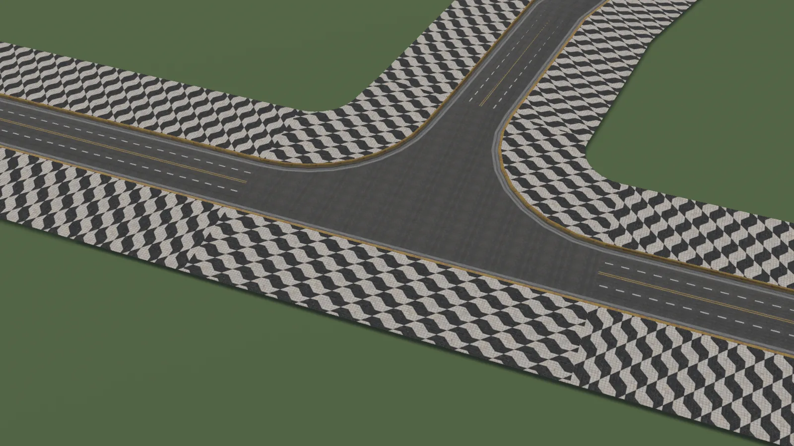

# Junctions

A **junction** is the mesh that joins roads where they meet. World Toolkit generates it from the roads' layers: lanes, borders and sidewalks continue into the junction, and the middle is filled with a core surface.

<figure markdown="span">
  { loading=lazy }
  <figcaption>A four-way junction. The curbs and sidewalks follow the corners, and the lanes stop at each road mouth.</figcaption>
</figure>

<figure markdown="span">
  { loading=lazy }
  <figcaption>A T junction between a straight road and a curved branch.</figcaption>
</figure>

## Creating junctions

Junctions are created when roads meet:

- Draw a road and click on another road. See [Creating Roads](creating-roads.md#connecting-while-drawing).
- Drag a road end onto another road.
- Select linked splines and use **Create Roads/Junctions from Selection**.

Behind the scenes, the roads' knots are linked with a [Link Group](../splines/link-groups.md), so moving the junction moves all connected road ends together.

## Junction settings

**Continue Road Profile UVs**
:   Continues the road surface textures from each road into the junction entrance, instead of restarting them. The center keeps a flat (planar) mapping.

**Fallback Junction Core Material**
:   The material for core faces that don't continue a road profile. Leave it empty to keep the current one.

**Junction Core UV Scale**
:   Texture scale of the core.

**Core Subdivision Size**
:   The size of the triangles inside the core. Smaller values add detail without changing the junction's outline.

**Lock Materials**
:   Keeps the current material slots when the junction rebuilds.

**Mute**
:   Temporarily turns the junction off.

### Conversions

A **conversion** is where the borders of two neighbouring roads meet inside a junction, for example the curb going around a corner. Each one can be adjusted under **Conversion Adjustments**:

**Conversion Arc Radius** and **Conversion Arc Segments**
:   The radius and smoothness of the curve between the two roads' borders.

**Continue Border Profile UVs**
:   Continues the border textures (curbs, sidewalks) of both roads through the conversion. When it's off, **Border Triplanar UV Rotation** rotates the border texture instead.

**Two Mouth Transition**
:   Only for junctions that join exactly two roads, for example where a road changes width or profile. **Override Mouth Distances** controls where the transition sits. **Bias** moves the S-shaped transition toward the first road (0) or the second (1).

## Defaults for new junctions

The **Default Junction Settings** and **Conversions** sections of the Roads panel set the starting values for new junctions.

The Intersections settings apply to all junctions:

**Adjacent Pair Angle**
:   How far, in degrees, two roads can be from pointing in exactly opposite directions and still be paired as neighbours.

**Vertex Merge Distance**
:   Merges interior vertices closer than this. Road mouths and arcs stay fixed. Zero turns it off.

## Exporting junction information

Right-click a junction component and choose **Export Junction Information...** to save a text report of its connections and mesh. It's useful to attach to a [bug report](../support/reporting-issues.md) about a junction.
