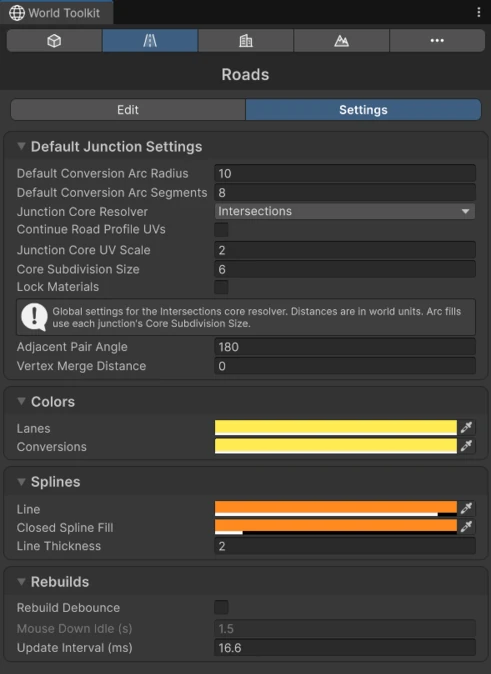

# Roads Settings

The **Settings** tab of the Roads panel.

## Default Junction Settings

<figure markdown="span" class="wtk-ui">
  { loading=lazy }
  <figcaption>The Settings tab of the Roads panel.</figcaption>
</figure>

The starting values of new [junctions](junctions.md): **Junction Core Resolver**, **Continue Road Profile UVs**, **Junction Core UV Scale**, **Core Subdivision Size** and **Lock Materials**.

**Conversions**
:   **Default Conversion Arc Radius** and **Default Conversion Arc Segments** for the curves between neighbouring roads.

**Intersections**
:   **Adjacent Pair Angle** and **Vertex Merge Distance**, which apply to every junction. See [Junctions](junctions.md#defaults-for-new-junctions).

## Colors

**Lanes**
:   The color of the lane guides drawn over roads in the Scene view.

## Splines

**Line**, **Closed Spline Fill** and **Line Thickness** of road splines in the Scene view.

## Rebuilds

How often roads and junctions rebuild while you drag. See [Rebuild settings](../getting-started/world-toolkit-window.md#rebuild-settings).
