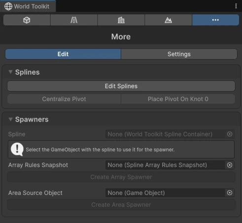

# Splines

Splines are curves made of **knots** (points) with handles that control how the curve bends between them. In World Toolkit they're the backbone of almost everything: roads, building footprints, terrain stamps, spawners, decals and spline-based primitives all start from a spline.

World Toolkit uses its own spline system, the **Spline Container** component, which every module edits the same way.

## Where to edit splines

<figure markdown="span" class="wtk-ui">
  { loading=lazy }
  <figcaption>Edit Splines is in the More tab of the World Toolkit window.</figcaption>
</figure>

- In the **More** tab of the [World Toolkit window](../getting-started/world-toolkit-window.md), click **Edit Splines**.
- Or **double-click** a Spline Container that is already selected in the Scene view.

While editing, Unity's tool context switches to **WTK: Splines**. The Roads, Buildings and Terrain modules use the same controls to edit their own splines.

## In this section

- [Spline Container](spline-container.md): creating and editing splines.
- [Point Anchors](point-anchors.md): attaching objects to a point on a spline.
- [Link Groups](link-groups.md): keeping knots of different splines together.
