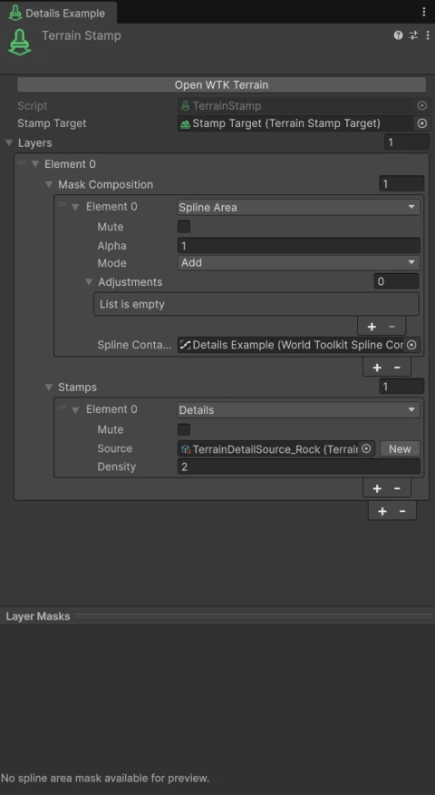
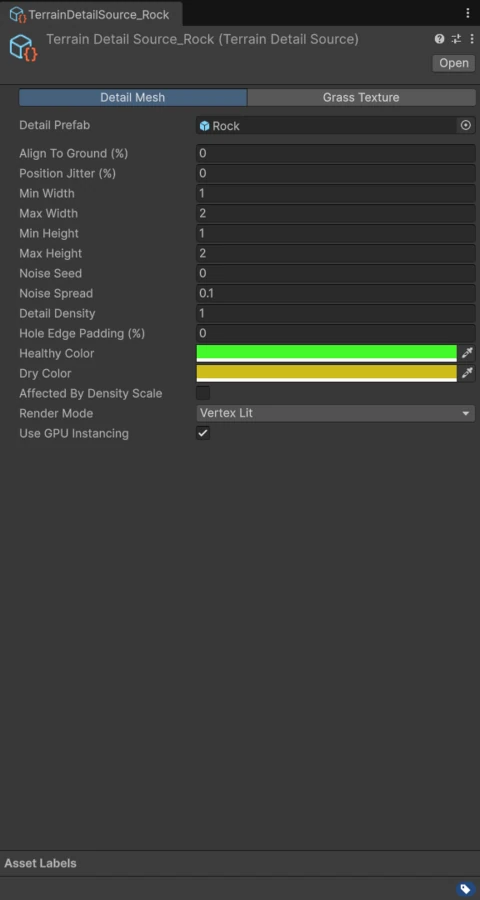

# Details

The **Details** operation places grass, flowers and other terrain details inside its [mask](masks.md).

<figure markdown="span" class="wtk-ui">
  { loading=lazy }
  <figcaption>A stamp with a Details operation.</figcaption>
</figure>

**Source**
:   A **Terrain Detail Source** asset describing the detail.

**Density**
:   How dense the details are.

## Terrain Detail Source

<figure markdown="span" class="wtk-ui">
  { loading=lazy }
  <figcaption>A Terrain Detail Source asset.</figcaption>
</figure>

Create one from **Assets > Create > World Toolkit > Terrain > Detail Source**. It holds the same settings as a Unity terrain detail, so you can reuse it across stamps and terrains:

- **Prototype** (a mesh prefab) or **Prototype Texture** (a grass texture), with **Render Mode**, **Use Prototype Mesh** and **Use Instancing**.
- **Width** and **Height** ranges.
- **Healthy Color** and **Dry Color**, with **Noise Seed** and **Noise Spread** for color variation.
- **Density**, **Target Coverage**, **Use Density Scaling** and **Position Jitter**.
- **Align To Ground**.
- **Hole Edge Padding**: keeps details away from the edges of [terrain holes](holes.md).
