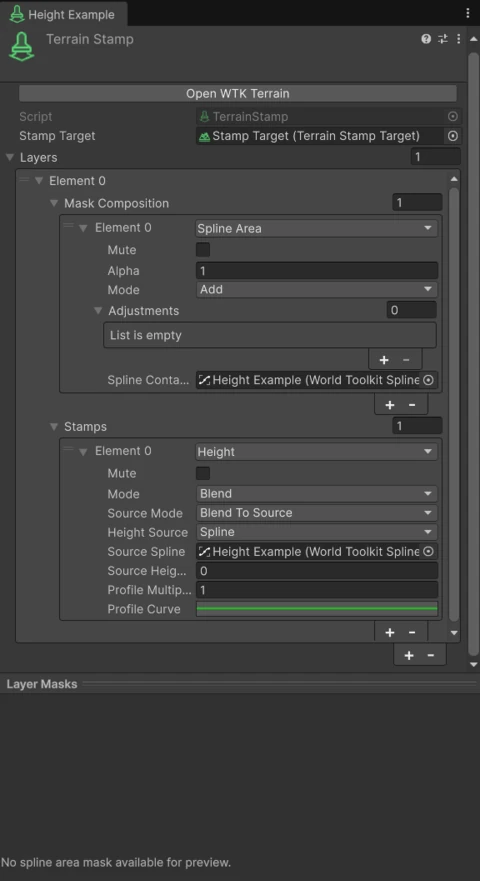

# Height

The **Height** operation changes the shape of the ground inside its [mask](masks.md).

## Apply Mode

<figure markdown="span" class="wtk-ui">
  { loading=lazy }
  <figcaption>A stamp with a Height operation.</figcaption>
</figure>

How the stamp's height combines with the terrain:

| Mode | Result |
|---|---|
| **Set** | Moves the terrain to the stamp height. |
| **Blend** | Blends from the terrain height to the stamp height, following the mask. |
| **Add** | Raises the terrain. |
| **Subtract** | Lowers the terrain. |
| **Clamp** | Cuts terrain that is above the stamp height down to it. Lower terrain is left untouched. |

## Height Source

The surface the stamp takes its height from:

**Spline**
:   The height of a spline. By default, the stamp's own outline: draw the outline at the height you want, and the ground follows it.

**Collider** / **Mesh**
:   The surface of a collider or a mesh. Use it to make the terrain match a road, a plaza or a building base. For meshes, **Use Front-Facing Triangles** chooses which side of the mesh counts.

**Height Offset** moves the result up or down.

## Source Mode and profile

**Blend To Source**
:   The terrain blends toward the source surface. The **Profile Curve** controls the blend, from the stamp's edge (0) to its interior (1).

**Offset From Source**
:   The terrain takes the source height plus the **Profile Curve**, scaled by **Profile Multiplier**. Use it to build shapes along the source, such as an embankment along a road or a ditch beside it.

!!! tip
    Combine **Height** with a **Border** mask adjustment for a soft transition into the surrounding terrain.
