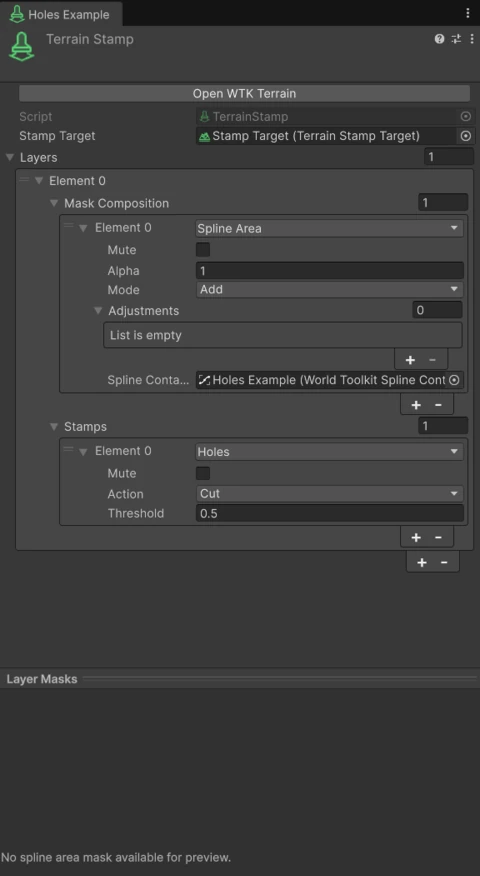

# Holes

The **Holes** operation cuts holes in the terrain inside its [mask](masks.md), for cave and tunnel entrances, or for openings where a mesh replaces the terrain.

<figure markdown="span" class="wtk-ui">
  { loading=lazy }
  <figcaption>A stamp with a Holes operation.</figcaption>
</figure>

**Action**
:   **Cut** makes holes. **Fill** closes holes made by stamps above it.

**Threshold**
:   The mask strength above which the terrain is cut.

Trees and details inside holes are removed. Details can keep a distance from hole edges with **Hole Edge Padding** in their [Detail Source](details.md#terrain-detail-source).
