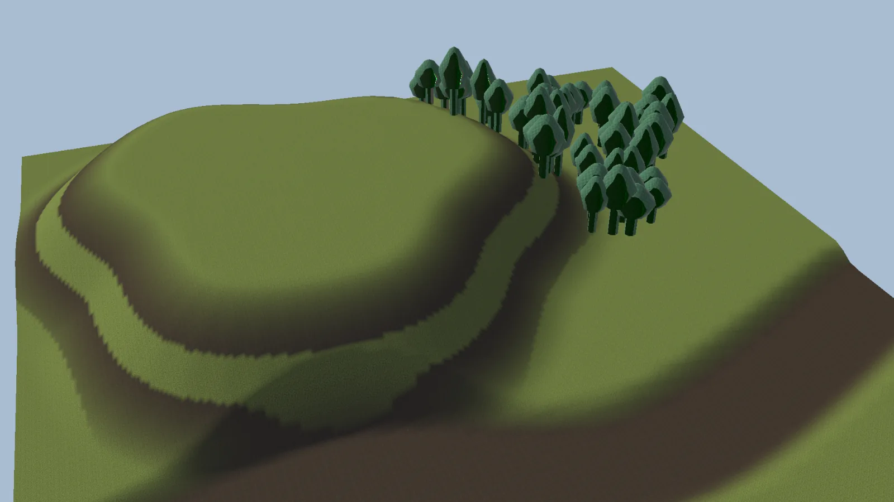

# Terrain

The Terrain module shapes and paints Unity terrains with **stamps**: objects in your scene that each apply one change (raise a hill, carve a riverbed, paint grass, place trees) inside an area you define.

Stamps are **non-destructive**. The terrain is always rebuilt from a saved base plus all the stamps, so you can move, reshape, reorder or delete any stamp at any time, and the terrain updates.

Open it from the **Terrain** tab of the [World Toolkit window](../getting-started/world-toolkit-window.md).

<figure markdown="span">
  { loading=lazy }
  <figcaption>Three stamps on a flat terrain: a hill, a riverbed and a wood.</figcaption>
</figure>

## How it fits together

:wtk-component-terrain-stamp-target: **Terrain Stamp Target**
:   Groups the terrains that stamps affect, and stores their **base**: the state of the terrain before any stamp.

:wtk-component-terrain-stamp: **Terrain Stamp**
:   One stamp. It has an area (usually a spline outline), and one or more **layers**. Each layer combines **masks** (where it applies) with **stamp operations** (what it does).

**Terrain Stamp Snapshot** (asset)
:   A saved stamp setup you can reuse for new stamps or apply to existing ones.

Stamps apply in **Hierarchy order**, top to bottom. Reorder them in the Hierarchy to change which one wins.

## In this section

- [Stamps](stamps.md): setting up targets and creating stamps.
- [Masks](masks.md): controlling where a stamp applies.
- [Height](height.md), [Erosion and Smoothing](erosion-and-smoothing.md): shaping the ground.
- [Textures](textures.md), [Trees](trees.md), [Details](details.md), [Holes](holes.md): painting and populating it.
- [Terrain Snap](terrain-snap.md): keeping objects and splines on the ground.
