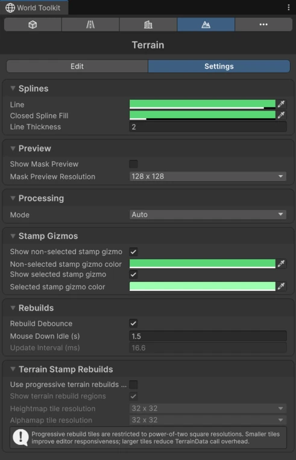

# Terrain Settings

The **Settings** tab of the Terrain panel.

## Splines

<figure markdown="span" class="wtk-ui">
  { loading=lazy }
  <figcaption>The Settings tab of the Terrain panel.</figcaption>
</figure>

**Line**, **Closed Spline Fill** and **Line Thickness** of stamp outlines in the Scene view.

## Preview

**Show Mask Preview**
:   Draws the selected stamp's mask on the terrain.

**Mask Preview Resolution**
:   The detail of that preview. Lower values update faster.

## Processing

**Mode**
:   Where stamps are computed: **Auto**, **Gpu** or **Burst Cpu**. Keep **Auto** unless you're tracking down a problem.

## Stamp Gizmos

Show or hide the outlines of selected and non-selected stamps, and their colors.

## Rebuilds

How often the terrain rebuilds while you drag a stamp. See [Rebuild settings](../getting-started/world-toolkit-window.md#rebuild-settings).

## Terrain Stamp Rebuilds

**Use progressive terrain rebuilds (experimental)**
:   Rebuilds the terrain in tiles, spread over several frames, which keeps the editor responsive on large terrains.

**Show terrain rebuild regions**
:   Draws the tiles being rebuilt.

**Heightmap tile resolution** and **Alphamap tile resolution**
:   The tile sizes. Smaller tiles keep the editor more responsive; larger tiles finish sooner overall.
