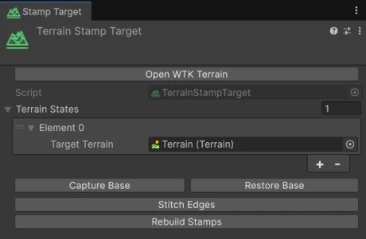
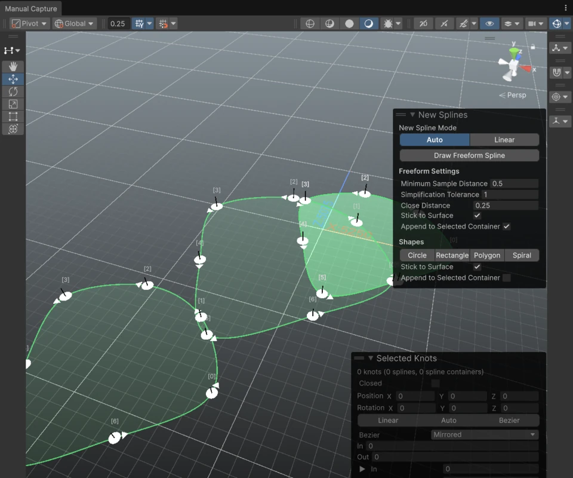
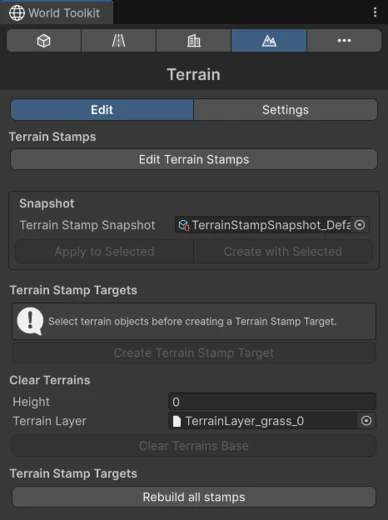
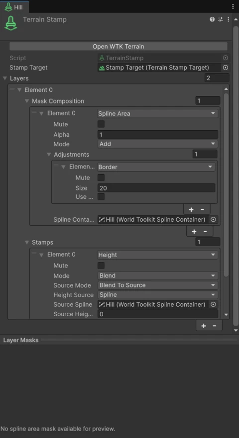

# Stamps

## Setting up a Stamp Target

<figure markdown="span" class="wtk-ui">
  { loading=lazy }
  <figcaption>The Terrain Stamp Target inspector.</figcaption>
</figure>

Stamps need a **Terrain Stamp Target**, which tells them which terrains to modify.

1. Select your terrain objects.
2. In the Terrain panel, under **Terrain Stamp Targets**, click **Create Terrain Stamp Target**.

The target's inspector has:

**Capture Base**
:   Saves the current terrain as the base that stamps build on. Do this before stamping, or after you sculpt the terrain by hand and want to keep those changes.

**Restore Base**
:   Puts the terrain back to its saved base, without any stamp.

**Stitch Edges**
:   Matches the edges of neighbouring terrain tiles so there are no seams.

**Rebuild Stamps**
:   Rebuilds the terrain from the base and every stamp.

**Clear Terrains Base**, in the Terrain panel, resets the base height of every terrain (and optionally paints a **Terrain Layer** over it). You'll be asked to confirm.

## Creating stamps

<figure markdown="span" class="wtk-ui-wide">
  { loading=lazy }
  <figcaption>Editing terrain stamps: each outline is a spline with numbered knots.</figcaption>
</figure>

<figure markdown="span" class="wtk-ui">
  { loading=lazy }
  <figcaption>The Terrain panel.</figcaption>
</figure>

1. In the Terrain panel, click **Edit Terrain Stamps**.
2. Hold ++shift++ and **click** to draw the stamp's outline.

New stamps start from the **Terrain Stamp Snapshot** set in the panel. Without one, they start with a single layer holding a [Height](height.md) operation.

To edit a stamp, select it and use **Edit Terrain Stamps**: click knots to select them, and drag knots or handles to reshape the stamp. Press ++esc++ to stop editing.

**Create with Selected** adds a stamp to the selected object instead, for example to turn an existing spline into a stamp.

## Stamp layers

<figure markdown="span" class="wtk-ui">
  { loading=lazy }
  <figcaption>A Terrain Stamp with a height layer and a slope-masked texture layer.</figcaption>
</figure>

A stamp is a list of **layers**. Each layer has:

**Masks**
:   Where the layer applies, and how strongly. See [Masks](masks.md).

**Stamps**
:   What the layer does there. Add one or more operations:

| Operation | What it does |
|---|---|
| [Height](height.md) | Raises, lowers or flattens the ground. |
| [Smooth](erosion-and-smoothing.md#smooth) | Softens the shape. |
| [Erosion](erosion-and-smoothing.md#erosion) | Simulates weathering by water or gravity. |
| [Texture](textures.md) | Paints a terrain layer. |
| [Trees](trees.md) | Places trees. |
| [Details](details.md) | Places grass and other details. |
| [Holes](holes.md) | Cuts or fills terrain holes. |

Every mask and operation has a **Mute** toggle to turn it off temporarily.

The **Layer Masks** preview in the inspector shows the combined mask of each layer.

## Snapshots

A **Terrain Stamp Snapshot** stores a stamp's layers so you can reuse them.

- **Create one from a stamp:** right-click the Terrain Stamp component and choose **Create Terrain Stamp Snapshot From Current Setup...**.
- **Create an empty one:** **Assets > Create > World Toolkit > Terrain > Stamp Snapshot**.
- **Apply it to existing stamps:** select them and click **Apply to Selected** in the Terrain panel.

## Settings

The Terrain panel's **Settings** tab has:

**Preview**
:   **Show Mask Preview** and **Mask Preview Resolution** draw the selected stamp's mask on the terrain.

**Processing**
:   **Mode** chooses where stamps are computed. **Auto** is recommended.

**Stamp Gizmos**
:   Show and color the outlines of selected and non-selected stamps.

**Terrain Stamp Rebuilds**
:   **Use progressive terrain rebuilds (experimental)** updates the terrain in tiles, which keeps the editor responsive on large terrains. **Show terrain rebuild regions** draws the tiles being rebuilt.

**Rebuild All Terrain Stamps** rebuilds every terrain from scratch.
