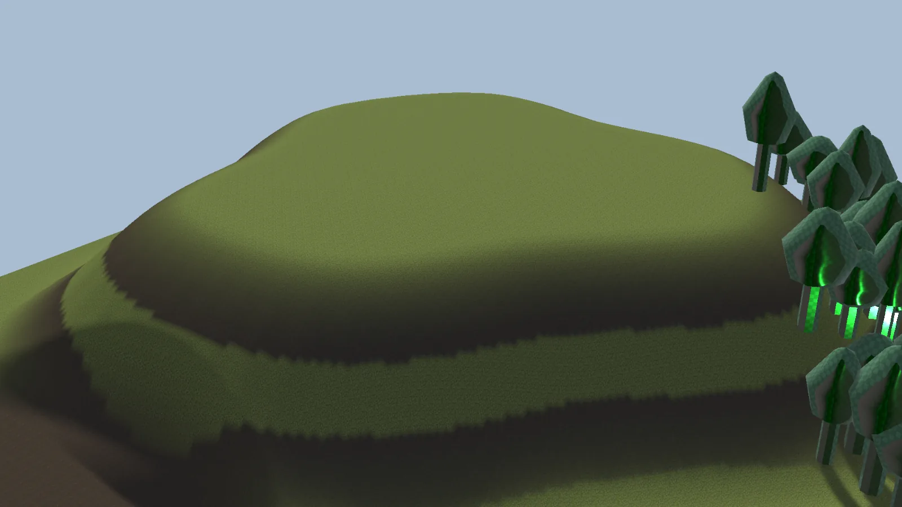

# Textures

The **Texture** operation paints a terrain layer inside its [mask](masks.md).

**Terrain Layer**
:   The terrain layer to paint. It's added to the terrains automatically if they don't have it yet.

**Opacity**
:   How strongly it's painted.

<figure markdown="span">
  { loading=lazy }
  <figcaption>Soil painted only where the hill is steep, using a Terrain Slope mask.</figcaption>
</figure>

!!! tip
    Use a **Terrain Slope** mask to paint rock on steep slopes, and a **Terrain Height** mask for snow on peaks. Add a **Noise** mask to break up the edges.
